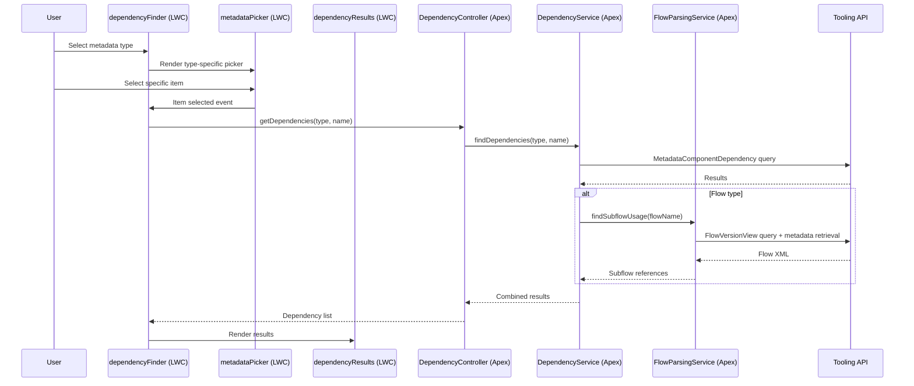

# Product Requirements Document: Where Is This Used? (WITU)

**Version**: 1.0
**Date**: 2026-02-16
**Author**: Simon (HD Consulting)
**Status**: Draft

---

## Table of Contents

1. [Executive Summary](#1-executive-summary)
2. [Goals & Success Metrics](#2-goals--success-metrics)
3. [User Personas](#3-user-personas)
4. [User Stories & Requirements](#4-user-stories--requirements)
5. [v1 Scope — Supported Metadata Types](#5-v1-scope--supported-metadata-types)
6. [Technical Architecture](#6-technical-architecture)
7. [UX Design](#7-ux-design)
8. [API Coverage & Blind Spots](#8-api-coverage--blind-spots)
9. [Security & AppExchange Requirements](#9-security--appexchange-requirements)
10. [Development Phases](#10-development-phases)
11. [Risks & Mitigations](#11-risks--mitigations)
12. [Competitive Landscape](#12-competitive-landscape)
13. [Release Plan](#13-release-plan)
14. [Open Questions / Future Considerations](#14-open-questions--future-considerations)

---

## 1. Executive Summary

### Problem Statement

Salesforce's native "Where is this used?" button has critical gaps that frustrate admins and developers daily:

- **Standard fields have no support at all** — you cannot see where `Account.Industry` or `Opportunity.StageName` is referenced across your org
- **Only works for custom fields** — no coverage for Flows, Apex Classes, Record Types, Custom Labels, or other metadata types
- **No reverse lookup for flows** — you cannot ask "which parent flows call this subflow?"
- **No granular context** — it tells you a flow uses a field, but not which element (screen, decision, assignment)

These gaps have been highly requested on the Salesforce IdeaExchange for years:
- [Expand Where is this used to standard fields](https://ideas.salesforce.com/s/idea/a0B8W00000Gdc0zUAB)
- [Expand Where is this Used for Flows / Subflows](https://ideas.salesforce.com/s/idea/a0B8W00000H4Q9sUAF)

### Solution Overview

**Where Is This Used? (WITU)** is a free, open-source Salesforce app that provides comprehensive dependency analysis for metadata types the native UI doesn't support. It runs natively inside Salesforce as a Lightning Web Component, queries the Tooling API's `MetadataComponentDependency` object (supplemented with targeted metadata parsing), and presents results in an intuitive, admin-friendly interface.

### Target Audience

- **Salesforce Admins** — need to understand impact before making changes
- **Salesforce Developers** — need to find all references before refactoring
- **Salesforce Architects** — need governance and impact analysis across the org

### Distribution

- **AppExchange**: Free managed package (one-click install)
- **GitHub**: Open source under MIT license
- Follows the same model as FormulaShare and Salesforce Labs apps

---

## 2. Goals & Success Metrics

### Primary Goals

1. **Fill the standard field gap** — provide "Where is this used?" for standard fields, the #1 missing capability
2. **Extend to other unsupported types** — Flows (as subflows), Apex Classes, and more
3. **Native experience** — run inside Salesforce, feel like a native feature, no external tools required
4. **Zero cost** — free on AppExchange, open source on GitHub

### Key Performance Indicators

| KPI | 6-month target | 12-month target |
|-----|----------------|-----------------|
| AppExchange installs | 500 | 2,000 |
| AppExchange rating | 4.0+ stars | 4.5+ stars |
| GitHub stars | 100 | 500 |
| GitHub contributors | 3 | 10 |
| Community mentions (Reddit, Trailblazer) | 20+ | 50+ |

### Non-Goals (Explicitly Out of Scope)

- **Not a metadata documentation tool** — we show dependencies, not descriptions or field-level docs
- **Not a deployment tool** — we don't create package.xml or change sets (Phase 3+ consideration)
- **Not a data dictionary** — tools like Elements.cloud or Metazoa cover that space
- **Not a real-time monitor** — we query on demand, not continuous monitoring
- **No paid tier** — this is and will remain free

---

## 3. User Personas

### Persona 1: Sarah — Salesforce Admin

| Attribute | Detail |
|-----------|--------|
| **Role** | Solo admin at a 200-person company |
| **Experience** | 3 years Salesforce, Certified Admin |
| **Technical skills** | Declarative (Flows, page layouts, validation rules). No Apex. |
| **Pain point** | "I need to deactivate a field but I have no idea what will break. Last time I deleted one and three flows errored out." |
| **Tool usage** | Setup menu, Flow Builder, Report Builder |
| **Goal** | Confidently make changes without breaking things |

### Persona 2: Marcus — Salesforce Developer

| Attribute | Detail |
|-----------|--------|
| **Role** | Senior developer on a 5-person Salesforce team |
| **Experience** | 7 years, Platform Developer II certified |
| **Technical skills** | Apex, LWC, integrations, CI/CD |
| **Pain point** | "I'm refactoring a utility class and need to find every component that calls it. The IDE find-in-files misses Flows and page layouts." |
| **Tool usage** | VS Code, SFDX CLI, Workbench |
| **Goal** | Complete impact analysis before refactoring |

### Persona 3: Priya — Salesforce Architect

| Attribute | Detail |
|-----------|--------|
| **Role** | Technical architect overseeing 3 Salesforce orgs |
| **Experience** | 12 years, Application & System Architect certified |
| **Technical skills** | Full stack, governance, release management |
| **Pain point** | "We have 400+ custom fields and nobody knows which ones are actually used. I need to audit and clean up." |
| **Tool usage** | Dependency analysis tools, metadata API, governance docs |
| **Goal** | Org hygiene, tech debt reduction, change governance |

---

## 4. User Stories & Requirements

### User Stories

#### Admin Stories

| ID | Story | Priority |
|----|-------|----------|
| US-A01 | As an admin, I want to see where a standard field is used so I can assess impact before modifying page layouts | P0 |
| US-A02 | As an admin, I want to see where a custom field is used so I can safely delete unused fields | P0 |
| US-A03 | As an admin, I want to see which parent flows call a specific subflow so I can understand flow dependencies | P0 |
| US-A04 | As an admin, I want a guided setup wizard so I can configure the app without developer help | P0 |
| US-A05 | As an admin, I want results grouped by component type so I can quickly scan what's affected | P1 |
| US-A06 | As an admin, I want a clear message when no dependencies are found so I know the field is safe to remove | P1 |

#### Developer Stories

| ID | Story | Priority |
|----|-------|----------|
| US-D01 | As a developer, I want to see which components reference an Apex class so I can refactor safely | P0 |
| US-D02 | As a developer, I want to see Read vs Write badges for Apex references to a field so I know the nature of the dependency | P1 |
| US-D03 | As a developer, I want to click a result to navigate to that component in Setup so I can inspect it directly | P2 |
| US-D04 | As a developer, I want to export results so I can include them in code review documentation | P2 |

#### Architect Stories

| ID | Story | Priority |
|----|-------|----------|
| US-R01 | As an architect, I want to analyze dependencies for any metadata type so I can assess change impact across the org | P0 |
| US-R02 | As an architect, I want a summary count per component type so I can quickly gauge the blast radius | P1 |
| US-R03 | As an architect, I want to analyze multiple items in bulk so I can audit large sets of metadata | P3 |

### Functional Requirements

| ID | Requirement | Priority | Stories |
|----|-------------|----------|---------|
| FR-001 | Query dependencies for standard fields using MetadataComponentDependency | P0 | US-A01 |
| FR-002 | Query dependencies for custom fields using MetadataComponentDependency | P0 | US-A02 |
| FR-003 | Detect subflow usage by parsing Flow metadata for `<subflow>` elements | P0 | US-A03 |
| FR-004 | Query dependencies for Apex classes using MetadataComponentDependency | P0 | US-D01 |
| FR-005 | Provide a type-first metadata picker (select type → select specific item) | P0 | US-R01 |
| FR-006 | Display results grouped by dependent component type in collapsible accordions | P1 | US-A05 |
| FR-007 | Show summary badges with count per component type | P1 | US-R02 |
| FR-008 | Show Read/Write badges for Apex references to fields | P1 | US-D02 |
| FR-009 | Provide a 6-step setup wizard for External Client App, External Credential, and Named Credential configuration | P0 | US-A04 |
| FR-010 | Include a "Test Connection" button in the setup wizard | P0 | US-A04 |
| FR-011 | Display an empty state when no dependencies are found | P1 | US-A06 |
| FR-012 | Handle and display errors gracefully (API failures, auth issues, limits) | P0 | All |
| FR-013 | Provide deep links to dependent components in Salesforce Setup | P2 | US-D03 |
| FR-014 | Export results to CSV | P2 | US-D04 |
| FR-015 | Support bulk analysis of multiple metadata items | P3 | US-R03 |

### Non-Functional Requirements

| ID | Requirement | Target |
|----|-------------|--------|
| NFR-001 | Query response time for typical lookups (< 50 dependents) | < 3 seconds |
| NFR-002 | Support orgs with up to 2,000 dependencies per component | Handle gracefully with pagination message |
| NFR-003 | WCAG 2.1 AA accessibility compliance | SLDS components handle this natively |
| NFR-004 | All Apex test coverage | ≥ 75% (AppExchange requirement) |
| NFR-005 | Support Salesforce API version | 65.0+ |
| NFR-006 | No stored data | Zero custom objects, all queries are real-time |
| NFR-007 | Work in both Classic and Lightning Experience | Lightning Experience only (LWC requirement) |
| NFR-008 | Support Enterprise, Unlimited, Developer, and Performance editions | Required for AppExchange |

---

## 5. v1 Scope — Supported Metadata Types

### 5.1 Standard Fields

**The #1 gap this app fills.**

| Aspect | Detail |
|--------|--------|
| **Query** | `SELECT MetadataComponentName, MetadataComponentType FROM MetadataComponentDependency WHERE RefMetadataComponentName = 'Account.Industry' AND RefMetadataComponentType = 'StandardEntity'` |
| **Picker UX** | Select object → select standard field from filtered list |
| **Results show** | Validation Rules, Formulas, Flows, Apex Classes, Triggers, VF Pages, LWC, Page Layouts, Field Sets, Email Templates |
| **Limitations** | Reports excluded from API; some standard fields may have incomplete tracking |

### 5.2 Custom Fields

| Aspect | Detail |
|--------|--------|
| **Query** | `SELECT ... FROM MetadataComponentDependency WHERE RefMetadataComponentName = 'Account.MyField__c' AND RefMetadataComponentType = 'CustomField'` |
| **Picker UX** | Select object → select custom field from filtered list |
| **Results show** | Same as standard fields, plus Read/Write badges for Apex references |
| **Read/Write detection** | Parse `MetadataComponentType` and analyze the dependency direction — write operations (DML) vs read operations (SOQL/formula) are inferred from context |
| **Limitations** | Reports excluded; Sharing Rules, List Views, Profile/PermSet FLS not tracked |

### 5.3 Flows (Subflow Detection)

| Aspect | Detail |
|--------|--------|
| **Problem** | MetadataComponentDependency does NOT track Flow→Flow (subflow) references |
| **Workaround** | 1) Query `FlowVersionView` to get all active flow versions. 2) Retrieve Flow metadata via Tooling API. 3) Parse XML for `<subflow>` elements matching the target flow's API name. |
| **Picker UX** | Search/select from active flows |
| **Results show** | Parent flows that invoke this flow as a subflow, plus any standard MetadataComponentDependency results (Apex invocations, Lightning Page references) |
| **Limitations** | Requires iterating over flow metadata — may be slow for orgs with many flows; only detects subflow references, not Screen Flow embedding |

### 5.4 Apex Classes

| Aspect | Detail |
|--------|--------|
| **Query** | `SELECT ... FROM MetadataComponentDependency WHERE RefMetadataComponentName = 'MyUtilityClass' AND RefMetadataComponentType = 'ApexClass'` |
| **Picker UX** | Search/select from Apex classes |
| **Results show** | Other Apex Classes, Apex Triggers, VF Pages, VF Components, LWC, Aura Components, Flow Actions |
| **Limitations** | Dynamic class references (e.g., `Type.forName()`) not detected |

---

## 6. Technical Architecture

### High-Level Architecture

```mermaid
graph LR
    A[LWC UI] -->|@AuraEnabled| B[Apex Controller]
    B --> C[DependencyService]
    C -->|Named Credential| D[Tooling API]
    C --> E[FlowParsingService]
    E -->|Named Credential| D
    B --> F[MetadataPickerController]
    F -->|SOQL| G[Org Metadata]
```

### Component Interaction Flow



### Authentication

The app queries the Tooling API via HTTP callout because `UserInfo.getSessionId()` does not work in Lightning context (Salesforce security policy). The required setup uses the modern **External Client App** approach (Connected Apps are being phased out as of Spring '26):

1. **External Client App** — OAuth application (replaces Connected App) with `api` and `refresh_token` scopes
2. **Auth Provider** — Salesforce type, referencing the External Client App
3. **External Credential** — stores the authenticated session; create a Principal and authenticate
4. **Named Credential** — `WITU_ToolingAPI`, pointing to the org's own Tooling API endpoint, using the External Credential
5. **Permission Set** — grants External Credential Principal Access to users who run the app

The setup wizard LWC guides admins through all 6 steps. See `docs/delivered/setup-guide.md` for the full guide with troubleshooting.

### Package Structure

```
force-app/main/default/
├── classes/
│   ├── DependencyService.cls          ← core: queries MetadataComponentDependency
│   ├── DependencyServiceTest.cls
│   ├── DependencyController.cls       ← @AuraEnabled methods for LWC
│   ├── DependencyControllerTest.cls
│   ├── MetadataPickerController.cls   ← powers object/field/flow/class pickers
│   ├── MetadataPickerControllerTest.cls
│   ├── FlowParsingService.cls         ← parses Flow metadata for subflow refs
│   └── FlowParsingServiceTest.cls
├── lwc/
│   ├── dependencyFinder/              ← main container component
│   ├── metadataPicker/                ← type → object → field picker
│   ├── dependencyResults/             ← results display (accordion + badges)
│   └── setupWizard/                   ← Named Credential setup guide
├── tabs/
│   └── Where_Is_This_Used.tab
├── flexipages/
│   └── Where_Is_This_Used_Page.flexipage
├── permissionsets/
│   └── Where_Is_This_Used_User.permissionset
└── applications/
    └── Where_Is_This_Used.app
```

### Key API Details

**MetadataComponentDependency** has 9 fields:

| Field | Purpose |
|-------|---------|
| `Id` | Row identifier |
| `MetadataComponentId` | ID of the dependent (the "user") |
| `MetadataComponentName` | Name of the dependent |
| `MetadataComponentType` | Type of the dependent |
| `MetadataComponentNamespace` | Namespace of the dependent |
| `RefMetadataComponentId` | ID of the referenced (the "used") |
| `RefMetadataComponentName` | Name of the referenced |
| `RefMetadataComponentType` | Type of the referenced |
| `RefMetadataComponentNamespace` | Namespace of the referenced |

**Query pattern** (standard lookup):
```sql
SELECT MetadataComponentId, MetadataComponentName, MetadataComponentType,
       MetadataComponentNamespace
FROM MetadataComponentDependency
WHERE RefMetadataComponentName = :targetName
  AND RefMetadataComponentType = :targetType
```

**Limits**: 2,000 rows per Tooling API query. If the limit is hit, the UI displays a warning: "Showing first 2,000 results. There may be additional dependencies not displayed."

### Subflow Detection (FlowParsingService)

Since MetadataComponentDependency does not track Flow→Flow subflow references:

1. Query `FlowVersionView` for all active flow versions: `SELECT FlowDefinitionView.ApiName, FlowDefinitionView.Label FROM FlowVersionView WHERE Status = 'Active'`
2. For each flow, retrieve metadata via Tooling API: `GET /services/data/v65.0/tooling/sobjects/Flow/{flowId}`
3. Parse the Flow metadata XML for `<subflow><flowName>TargetFlowApiName</flowName></subflow>`
4. Return matching parent flows

**Optimization**: This is expensive for orgs with hundreds of flows. v1 caps at 200 flows scanned with a warning if more exist. Future phases may add caching or background processing.

### Error Handling Strategy

| Error | Handling |
|-------|----------|
| Named Credential not configured | Show setup wizard with instructions |
| Auth token expired | Display "Re-authorize" message with link to setup |
| Tooling API timeout | Retry once, then show error with "Try Again" button |
| 2,000 row limit hit | Show results + warning banner |
| Unknown MetadataComponentType selected | Show "This type is not yet supported" with link to GitHub issues |
| Network/server error | Generic error toast with details in console |

---

## 7. UX Design

### Design Reference

See the interactive mockup at [`docs/delivered/design-mockup.html`](delivered/design-mockup.html) for the full visual design. Open in a browser to interact with it.

### Type-First Metadata Picker Flow

```
┌──────────────────────────────────────────────┐
│  1. Select Type        2. Select Item        │
│  ┌──────────────┐     ┌───────────────────┐  │
│  │ ▼ Standard   │     │ Account           │  │
│  │   Field      │     │ ▼ Industry        │  │
│  │   Custom     │     │                   │  │
│  │   Field      │     │   [Find Usages]   │  │
│  │   Flow       │     │                   │  │
│  │   Apex Class │     └───────────────────┘  │
│  └──────────────┘                            │
└──────────────────────────────────────────────┘
```

**Step 1**: User selects the metadata type from a dropdown. This determines the sub-picker shown in step 2.

**Step 2**: Type-specific picker appears:
- **Standard/Custom Field**: Object picklist → Field picklist (filtered to standard or custom)
- **Flow**: Searchable combobox of active flows
- **Apex Class**: Searchable combobox of Apex classes

**Step 3**: "Find Usages" button triggers the query.

### Results Display

Results are displayed in collapsible SLDS accordion sections, one per dependent component type:

```
┌─────────────────────────────────────────────────────┐
│  Where is Account.Industry used?                     │
│                                                       │
│  Summary: 12 dependencies found                       │
│  [Flow: 4] [Apex: 3] [Validation Rule: 2]           │
│  [Page Layout: 2] [LWC: 1]                           │
│                                                       │
│  ▼ Flow (4)                                           │
│    ⚡ Lead_Qualification_Flow                         │
│    ⚡ Account_Enrichment_Flow                         │
│    ⚡ Industry_Routing_Flow                            │
│    ⚡ Onboarding_Subflow          [Decision]          │
│                                                       │
│  ▶ Apex Class (3)                                     │
│  ▶ Validation Rule (2)                                │
│  ▶ Page Layout (2)                                    │
│  ▶ Lightning Web Component (1)                        │
└─────────────────────────────────────────────────────┘
```

**Badges**:
- **Component type icons** — SLDS standard icons per type (⚡ Flow, `</>` Apex, etc.)
- **Read/Write badges** — for Apex field references: green "Read" or orange "Write"
- **Decision/Assignment/Screen badges** — for Flow element context (future phase)
- **Summary badges** — pill-style count badges at the top

### Setup Wizard Flow

The setup wizard is a 6-step guided process shown when the Named Credential is not configured:

| Step | Title | What the user does |
|------|-------|--------------------|
| 1 | Create External Client App | Setup → Apps → External Client App Manager → New; enable OAuth, copy Consumer Key/Secret |
| 2 | Create Auth Provider | Setup → Identity → Auth. Providers → New; paste credentials, copy Callback URL back to External Client App |
| 3 | Create External Credential | Setup → Named Credentials → External Credentials tab → New; create Principal, authenticate |
| 4 | Create Named Credential | Setup → Named Credentials → New; use `WITU_ToolingAPI`, select External Credential |
| 5 | Grant Permission Set Access | Edit permission set → External Credential Principal Access → enable Principal; assign to users |
| 6 | Test Connection | Click "Test Connection" button → success or error message |

Each step includes:
- Step indicator (1/4, 2/4, etc.)
- Exact field values to enter (pre-filled, copy-paste ready)
- Screenshot/description of where to find the setting in Setup
- "I've completed this step" checkbox to advance

### States

| State | Display |
|-------|---------|
| **Initial** | Type picker visible, no results |
| **Loading** | SLDS spinner with "Searching for dependencies..." |
| **Results** | Accordion sections with summary badges |
| **Empty** | Illustration + "No dependencies found. This component doesn't appear to be referenced anywhere." |
| **Error (auth)** | Alert banner + link to setup wizard |
| **Error (API)** | Alert banner + error details + "Try Again" button |
| **Limit warning** | Yellow banner: "Showing first 2,000 results..." above results |

### SLDS Compliance

- All components use SLDS base components (`lightning-accordion`, `lightning-badge`, `lightning-combobox`, `lightning-spinner`, etc.)
- Follow SLDS spacing, typography, and color tokens
- No custom CSS that overrides SLDS patterns
- The app should be indistinguishable from a native Salesforce feature

---

## 8. API Coverage & Blind Spots

### What MetadataComponentDependency Tracks

| Referenced type (looking up) | Found in these dependent types |
|------------------------------|-------------------------------|
| Standard Fields | Validation Rules, Formulas, Flows, Apex, Triggers, VF Pages, LWC, Page Layouts, Field Sets, Email Templates |
| Custom Fields | Same as Standard Fields |
| Apex Classes | Other Apex, Triggers, VF Pages, VF Components, LWC, Aura, Flow Actions |
| Custom Labels | Apex, Triggers, VF Pages, Lightning Components |
| Custom Objects | VF, Apex, Triggers, Flows, LWC, Quick Actions, Lightning Pages |
| Lightning Components | Other LWC/Aura, Lightning Pages, Quick Actions |
| Flows | Apex invocations, Lightning Pages |

### Known Blind Spots

| Blind Spot | Impact | Workaround |
|------------|--------|------------|
| **Reports** — completely excluded from API | Cannot show field usage in reports | None. Display disclaimer: "Report references are not included." |
| **Flow → Flow (subflow)** — not tracked | Cannot detect subflow usage via standard query | `FlowParsingService`: parse Flow metadata XML for `<subflow>` elements |
| **Sharing Rules** — not tracked | Cannot show field usage in sharing criteria | None for v1 |
| **List Views** — not tracked | Cannot show field usage in list view filters/columns | None for v1 |
| **Profile/PermSet FLS** — not tracked | Cannot show which profiles grant access to a field | None for v1 |
| **Dynamic Apex** — not detectable | `Type.forName()`, dynamic SOQL with string concatenation | None (inherently undetectable via static analysis) |
| **Report Types** — not tracked | Cannot show custom report type field mappings | None for v1 |

### Fallback Strategy if API Is Deprecated

If Salesforce kills `MetadataComponentDependency`, the fallback approach:

1. **Apex/Trigger bodies**: Query `ApexClass.Body` and `ApexTrigger.Body` via Tooling API, string-search for references
2. **Flow metadata**: Retrieve Flow XML via Metadata API, parse for field/object references
3. **VF markup**: Query `ApexPage.Markup` and `ApexComponent.Markup`, search for references
4. **LWC/Aura**: Retrieve component bundles, search JavaScript and markup

This is ~100x more API-intensive and would require Queueable/Batch Apex for async processing. The `DependencyService` abstraction is specifically designed to make this swap possible — only that one class changes.

**Risk assessment**: MetadataComponentDependency has been Beta since Summer '18 (7+ years). Salesforce has never removed a widely-used Tooling API object. More likely it stays in perpetual beta or eventually GAs.

---

## 9. Security & AppExchange Requirements

### AppExchange Security Review Checklist

| Requirement | Implementation |
|-------------|----------------|
| **CRUD/FLS enforcement** | All SOQL queries respect user permissions; describe calls check field accessibility |
| **No SOQL injection** | All dynamic queries use bind variables or `String.escapeSingleQuotes()` |
| **No hardcoded credentials** | Auth via Named Credential only; no tokens, passwords, or session IDs in code |
| **`with sharing` keyword** | All Apex classes use `with sharing` (enforces record-level security) |
| **Test coverage** | ≥ 75% across all Apex classes (target: 90%+) |
| **No `UserInfo.getSessionId()`** | Named Credential handles auth — session ID never used |
| **Named Credential for callouts** | `WITU_ToolingAPI` Named Credential for all Tooling API requests |
| **No external data storage** | Zero custom objects, zero external calls except to the org's own Tooling API |
| **XSS prevention** | LWC framework handles output encoding natively |
| **Lightning Locker/LWS compliance** | Standard LWC patterns, no DOM manipulation, no eval() |

### Permission Set

The `Where_Is_This_Used_User` permission set grants:
- Access to the `Where Is This Used` tab
- Access to the `Where Is This Used` app
- Access to all Apex classes in the package
- External Credential Principal Access (admin enables the Principal in the permission set during setup)

Admins assign this permission set to users who need the tool.

---

## 10. Development Phases

### Phase 1 — MVP (v1.0)

**Goal**: Ship the core product — 4 metadata types, setup wizard, clean UI.

| Feature | Details |
|---------|---------|
| Standard Field dependencies | Full MetadataComponentDependency query |
| Custom Field dependencies | With Read/Write badges for Apex |
| Flow subflow detection | FlowParsingService + MetadataComponentDependency |
| Apex Class dependencies | Full MetadataComponentDependency query |
| Setup wizard | 6-step guided External Client App + External Credential + Named Credential setup |
| Type-first metadata picker | Dropdown → type-specific sub-picker |
| Accordion results display | Grouped by type, summary badges |
| Error handling | Auth errors, API errors, limit warnings |
| Permission set | Package permission set |
| AppExchange listing | Free managed package |

**Estimated effort**: 4–6 weeks

### Phase 2 — Extended Metadata Types (v1.1)

| Feature | Details |
|---------|---------|
| Record Types | Where is this record type referenced in Flows, Apex, layouts, assignment rules |
| Custom Labels | References in Apex, VF, LWC, Aura |
| Platform Events | Publishers and subscribers |
| Validation Rules | What fields/objects does this rule reference |
| Custom Metadata Types | Where are CMDT records used |

**Estimated effort**: 3–4 weeks

### Phase 3 — Enhanced Features (v1.2)

| Feature | Details |
|---------|---------|
| CSV/Excel export | Download results |
| Deep links | Click a result to navigate to that component in Setup |
| Granular location | Show which Flow element, which Apex line, which VF section |
| Improved Read/Write detection | More accurate Apex DML vs SOQL analysis |
| Performance optimization | Caching layer for repeated queries |

**Estimated effort**: 4–5 weeks

### Phase 4 — Community Features (v2.0)

| Feature | Details |
|---------|---------|
| Bulk analysis | Analyze all fields on an object at once |
| Dependency graph visualization | D3.js-style visual dependency map |
| "Unused metadata" report | Find fields/flows/classes with zero dependencies |
| Package.xml export | Generate package.xml from dependency results |
| Scheduled analysis | Periodic dependency snapshots with change detection |

**Estimated effort**: 6–8 weeks

---

## 11. Risks & Mitigations

| Risk | Likelihood | Impact | Mitigation |
|------|-----------|--------|------------|
| **MetadataComponentDependency removed** | Very Low | Critical | `DependencyService` abstraction enables swap to brute-force parsing. API has been stable 7+ years. |
| **2,000 row query limit** | Medium | Medium | Display warning when limit hit. Phase 4 could use Bulk API 2.0 (100K limit) for power users. |
| **Reports excluded from API** | Certain | Medium | Display disclaimer. Monitor Salesforce releases for changes. No workaround exists. |
| **Flow→Flow blind spot** | Certain | Medium | `FlowParsingService` parses Flow metadata. Caps at 200 flows for v1 performance. |
| **Subflow scan performance** | Medium | Medium | Cap scanned flows, show progress indicator, consider background processing in future phases. |
| **AppExchange security review rejection** | Low | High | Follow all documented security requirements. Test with Salesforce Scanner (PMD rules). Run `sf scanner` before submission. |
| **Named Credential setup complexity** | Medium | Medium | Setup wizard with step-by-step instructions, copy-paste values, and test connection. Comprehensive troubleshooting guide. |
| **API version changes** | Low | Low | Pin to API v65.0, test against new versions before updating. |

---

## 12. Competitive Landscape

| Feature | **WITU** | **HappySoup.io** | **dependencies-cli** | **Salto** |
|---------|----------|-------------------|----------------------|-----------|
| **Status** | Active (new) | Unclear (~2023) | ❌ Archived May 2025 | Active (commercial) |
| **Price** | Free | Free | Free | Paid |
| **Standard fields** | ✅ First-class | Unclear/limited | ❌ | ✅ |
| **Subflow detection** | ✅ Flow metadata parsing | ❌ | ❌ | ✅ |
| **Read/Write badges** | ✅ | ✅ | ❌ | ✅ |
| **Runs inside Salesforce** | ✅ Native LWC | ❌ External web app | ❌ CLI only | ❌ External |
| **One-click install** | ✅ AppExchange | ❌ Docker/Heroku setup | ❌ SFDX plugin | ❌ Enterprise setup |
| **Open source** | ✅ MIT | ✅ MIT | ✅ BSD-3 | ❌ |
| **Granular location** | Phase 3 | Partial (Apex lines) | ❌ | ✅ |
| **Export** | Phase 3 | ✅ Excel/CSV | ❌ | ✅ |
| **Graph visualization** | Phase 4 | ❌ | ✅ D3.js | ✅ |
| **Admin-friendly** | ✅ No CLI needed | ⚠️ Needs Docker/web setup | ❌ CLI only | ⚠️ Enterprise tool |

### Key Differentiators

1. **Native Salesforce experience** — runs inside the org, no external tools, looks and feels like a Salesforce feature
2. **Standard field support** — the #1 gap that no free tool fills well
3. **Admin-friendly** — one-click AppExchange install, no CLI or Docker knowledge needed
4. **Free + open source** — no cost barrier, community-driven development
5. **Subflow detection** — solves the Flow→Flow blind spot with metadata parsing

---

## 13. Release Plan

### GitHub Repository Structure

```
where-is-this-used/
├── force-app/                    ← Salesforce source (SFDX format)
│   └── main/default/
├── docs/
│   ├── prd.md                    ← This document
│   ├── discussion.md             ← Research & decisions
│   ├── design-mockup.html        ← Interactive UI mockup
│   ├── delivered/
│   │   └── setup-guide.md        ← Admin setup instructions (delivered as-is)
│   └── troubleshooting.md        ← Common issues & fixes
├── scripts/                      ← Build/deploy scripts
├── sfdx-project.json
├── README.md
├── LICENSE                       ← MIT
├── CONTRIBUTING.md
├── CHANGELOG.md
└── .github/
    ├── ISSUE_TEMPLATE/
    └── workflows/                ← CI/CD (scratch org tests)
```

### AppExchange Listing Plan

| Item | Detail |
|------|--------|
| **Price** | Free |
| **Listing name** | Where Is This Used? |
| **Tagline** | "Find every dependency for standard fields, flows, and more — natively in Salesforce" |
| **Category** | Admin Tools / Development Tools |
| **Screenshots** | Type picker, results display, setup wizard, empty state |
| **Security review** | Submit after Phase 1 complete; no fees for free apps |
| **Supported editions** | Enterprise, Unlimited, Developer, Performance |

### Documentation Plan

| Document | Audience | Contents |
|----------|----------|----------|
| **README.md** | All | Overview, install link, quick start, screenshots, contributing |
| **Setup Guide** | Admins | Step-by-step External Client App, External Credential, and Named Credential setup with troubleshooting |
| **Troubleshooting** | All | Common errors, auth issues, API limits, FAQ |
| **CONTRIBUTING.md** | Developers | Dev setup, scratch org instructions, PR guidelines |
| **CHANGELOG.md** | All | Version history, what's new |

### Marketing Plan

| Channel | Action | Timing |
|---------|--------|--------|
| **Reddit** (r/salesforce) | Launch post: "I built a free app that adds 'Where is this used?' for standard fields" | Launch day |
| **LinkedIn** | Article + post about the problem and solution | Launch day |
| **Salesforce Trailblazer Community** | Post in Admin and Developer groups | Launch week |
| **Twitter/X** | Thread showing the problem + demo GIF | Launch day |
| **YouTube** | 3-minute demo video | Launch week |
| **Salesforce Ben** | Pitch for inclusion in tools roundup | Post-launch |
| **Unofficial SF** (Slack) | Share in #admin-tools and #dev-tools | Launch week |

---

## 14. Open Questions / Future Considerations

### Open Questions

1. **Managed vs Unlocked package?** — Managed package protects code but limits flexibility. Unlocked package allows more customization. Current decision: managed (standard for AppExchange). Revisit based on community feedback.

2. **Namespace prefix** — Need to register a namespace (e.g., `witu`) for the managed package. This affects all Apex class and component names in the installed org.

3. **API version pinning strategy** — Pin to v65.0 for launch. How aggressively to update? Consider testing against beta API versions for early warning.

4. **Bulk API 2.0 for large orgs** — The 2,000 row limit is fine for most lookups but may be restrictive for heavily-used standard fields (e.g., `Account.Name`). Should Phase 2 include a Bulk API option?

5. **Caching strategy** — v1 is real-time only. When does caching become necessary? Consider platform cache for repeated queries within a session.

### Future Considerations

- **Salesforce CLI plugin** — complementary CLI for developers who prefer terminal workflows
- **VS Code extension** — right-click a field/class name → "Where is this used?"
- **Slack integration** — `/witu Account.Industry` in Slack → dependency summary
- **Multi-org analysis** — for architects managing multiple connected orgs
- **AI-powered impact analysis** — "What will break if I delete this field?" with confidence scores
- **Integration with DevOps tools** — surface dependencies in Copado, Gearset, Flosum pipelines
- **Dependency diff** — compare dependencies between two points in time (requires stored snapshots)

---

*This PRD is a living document. Update it as decisions are made and scope evolves.*
